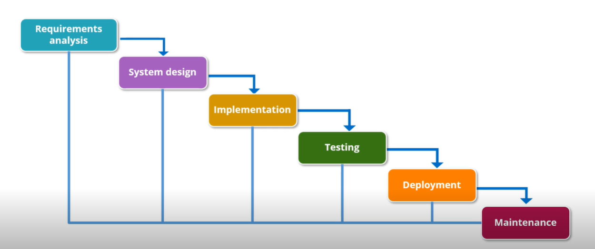
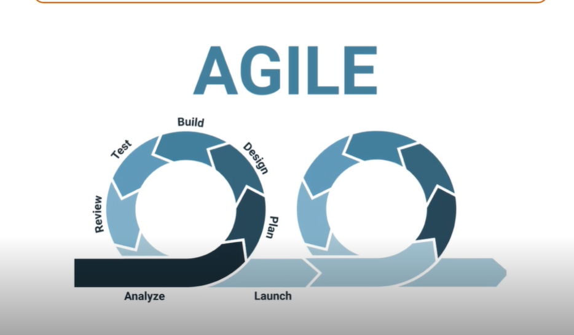
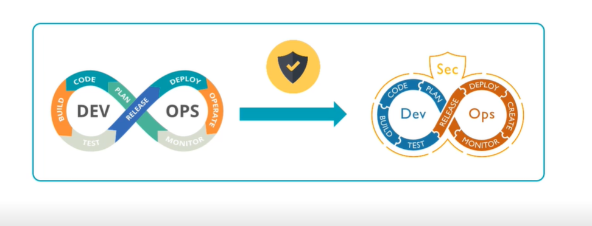
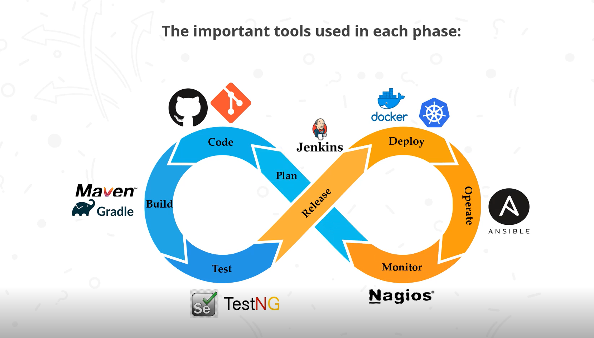

# Traditional Software Development Approaches

## Waterfall model

The waterfall model is a traditional software development model that uses a linear and sequential approach for software development.



| Advantages                                                   | Disadvantages                                                |
| ------------------------------------------------------------ | ------------------------------------------------------------ |
| - Easy to use<br />- Cost effective<br />- Time saving <br />- Easy testing<br />- Suitable for small projects<br />- Managerial control | - Risky and uncertain.<br />- Not suitable for complex project.<br />- Final product available only at the end.<br />- Not suitable for projects with changing requirements.<br />- Difficult to make changes in the testing phase. |

## Agile Model

Agile model focuses on process adaptability and customer satisfaction by rapid delivery of the working software product.



| Advantaged                                                   | Disadvantaged                                                |
| ------------------------------------------------------------ | ------------------------------------------------------------ |
| - Dynamic response to requirements<br />- Cost effective<br />- Superior quality product<br />- Direct communication between stakeholders<br />- Best suited for large and long term projects<br />- Minimum resource requirement | - Poor document<br />- Difficult to estimate time and effort for complex project.<br />- Risky due to the ever evolving characteristics.<br />- Difficult to predict the expected results when requirements are unclear. |

## Relationship Between Agile and DevOps

The benefits of using Agile with DevOps are:

- Replace non-human steps using automation tools
- Improve collaboration between the teams
- Automate to create a potentially shippable increment

## DevOps Lifecycle

The DevOps is based on five phases, as follows:

- Continuous Development: manifests planning and coding. The scope of the project is determined during the planning and developers build the code.
- Continuous Testing: is the phase in which the application is rigorously tested for bugs. Automation test tools such as TestNG, JUnit, Selenium, and others are used for continuous testing. Docker Containers simulate the test environment in continuous testing. Jenkins assist in conducting automation of the test procedure. Automation testing saves a lot of time and work, unlike manual testing.
- Continuous Integration: is an essential phase of DevOps, which deals with
  software development. Frequent changes are made to the source code. Include Unit Testing, Integration Testing, Code Review, Code Packaging. The existing code is continuously and seamlessly put together with the new code, which leads to continuous development of software.
- Continuous Deployment: means that the implemented code is correctly deployed across all production servers. New code is continuously deployed, and configuration tools are required to manage it effectively. Tools is Chef, Puppet, Ansible, SaltStack, Codeship, AWS CodeDeploy, Terraform. Containerization plays a pivotal role in the deployment process.
- Continuous Monitoring: includes all operational aspects, where critical information
  about the software's use is recorded and analyzed to derive analytics. Tools is Nagios, Sensu, DataDog, AWS CloudWatch, Grafana, splunk.

## Benefits of DevOps

- Assured Rapid Deployment: Updates and improvements that happen faster and more frequently will not only please your customers but will also benefit your company.
- Balanced Working Environment: DevOps improves the working environment and brings stability in the workspace and strengthens productivity.
- Drastic Improvement over Quality: Product quality enhances due to the impact of coordination between development and operations teams, as well as timely gathering of user input.
- Repetitive Task Is Automated: DevOps has a range of benefits because it facilitates quick problem discovery, correction, and automation. The team has a lot more time to think out of the box.
- Proactive Growth of the Business: DevOps has made it feasible to attain scalability by improving the overall productivity of the business to stay ahead of the competition on a global scale.
- Continuous Delivery: All teams are responsible for ensuring stability and adding new features to deliver the software uninterrupted.
- Minimal Cost of Production: DevOps helps the team minimize costs for administration and production by keeping both maintenance and new updates together.
- Higher Productivity: It allows communication among team members, allowing them to concentrate more on their areas of expertise, removing barriers, and encouraging collaboration.

## DevSecOps

DevSecOps emerged from DevOps to integrate the management of security throughout the development process.



Collaboration between developers and security teams resulted in the development of a security as code culture.

**Benefits**

- Rapid and Cost-effective Software Delivery: Both time and costs can be reduced by minimizing the repetitive process of addressing security issues after delivery. Efficient and cost-effective due to integration of security.
- Improved Proactive Security: The cybersecurity process is involved in the development cycle. Security problems are taken up as soon as they are identified.
- Accelerated Security Vulnerability Patching 
- Automation Compatible with Modern Development: Automation can be adopted in cybersecurity testing.
- Repeatable and Adaptive: Repeatable and adaptive processes are applied constantly across the environments, changing adaptive requirements to dynamic ones.

## Quick Recap




## Version Control System

Using Git.

## CI/CD with Jenkins

Continuous Integration (CI): It is a development practice in which all development work is integrated as early as possible.

**Advantages of Continuous Integration are**

- Monitors the health of your code coverage metrics
- Reduces technical debts and maintenance cost
- Publicly visible code quality metrics
- Automated end-to-end acceptance tests
- Reduces risk by providing faster feedback
- Helps identify and fix integration and regression
- Helps simplify and accelerate delivery
- Automates deployment process

Continuous Delivery (CD): Continuous delivery is an extension of continuous integration. Any successful build can potentially be deployed into production.

Tools of CI/CD: Jenkins, TeamCity, CircleCI, GitLab.

Install Jenkins:

```bash
# Install java
java --version
# Add jenkins public key
wget -q -O - https://pkg.jenkins.io/debian/jenkins.io.key/ sudo apt-key add -
sudo sh-c 'echo deb http://pkgjenkins.io/debian-
stable binary/> /etc/apt/sources.list.d/jenkins.list
sudo apt-get update
# Install jenkins
sudo apt-get install jenkins
sudo service jenkins status
# Get password
sudo cat var/lib/jenkins/secrets/initialAdminPassword
# Access host
curl localhost:8080
```

## Software and Automation Testing Frameworks

Popular software and Automation testing tools

- Testim is the quickest way to create durable end-to-end tests, whether they're codeless, programmed, or both.
- LambdalTest is a popular tool for performing automated cross-browser testing.
- Selenium is a software testing tool that's used to perform Regression Testing.

## Configuration Management

- Configuration management (CM) is a system engineering method that ensures a product's characteristics remain consistent during its life cycle. 
- In the technology world, configuration management is an IT management mechanism that monitors individual configuration items of an IT system.

Features of Configuration Management:

- Enforcement: Prevents configuration drift
- Concurrency Management: Manages concurrency properly
- Version Control: Saves every change made to the file
- Synchronization: Allows to check out more than one file

**Benefits**

- It helps in increasing the efficiency with a well-defined configuration process that improves visibility and provides control with the help of tracking.
- It helps in cost optimization by having detailed knowledge of all the IT elements of the configuration, which helps to avoid unnecessary duplication.
- It provides greater agility and faster problem resolution, giving a better quality of service to the consumers.
- It enhances system and process reliability by detecting and correcting incorrect configurations before a detrimental effect on results.
-  It also provides faster restoration of your service if a process failure occurs, i.e If the appropriate state of configuration will be known, restoring the working configuration will be much faster and easier.

Role of Configuration Management in DevOps:

- Source Code Repository: Mostly used during the development process
- Artifact Repository: Used during the production and operations phases of a project
- Configuration Management Database: Used during the production and operations phases of a project

Configuration Management Tools: Puppet, Chef, Ansible, SaltStack,...

## Containerization with Docker

## 


